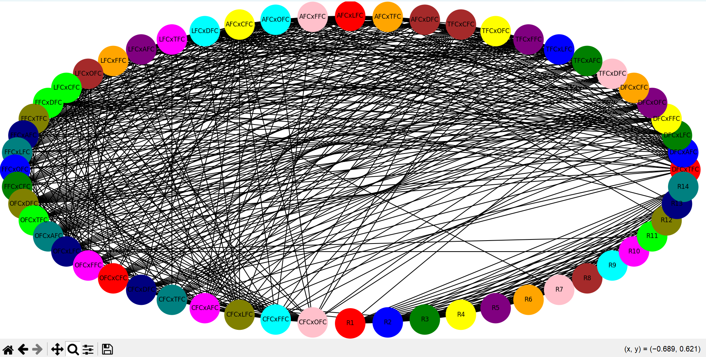

# DESENVOLVEDORES DO PROJETO:
- **Pedro Neris**  
  - GitHub: [github.com/pedro-neris](https://github.com/pedro-neris)  
  - LinkedIn: [www.linkedin.com/in/pedro-neris](https://www.linkedin.com/in/pedro-neris)  
- **Caue Trindade**
  - GitHub: [github.com/cauetrd](https://github.com/cauetrd)
  - LinkedIn: [www.linkedin.com/in/cau%C3%AA-trindade-4bab91263/](https://www.linkedin.com/in/cau%C3%AA-trindade-4bab91263/)

---

## OBJETIVO

Este projeto tem como objetivo gerar um calendário de rodadas para um campeonato de futebol com 7 times, respeitando restrições específicas de jogos. Para isso, foi desenvolvido um algoritmo de coloração de grafos, baseado no algoritmo descrito em [Graph Coloring Applications - GeeksforGeeks](https://www.geeksforgeeks.org/graph-coloring-applications/).

--- 

## LISTA DE TIMES

| Sigla | Nome do Time    |
| ----- | --------------- |
| DFC   | Dragões F.C.    |
| TFC   | Tubarões F.C.   |
| AFC   | Águias F.C.     |
| LFC   | Leões F.C.      |
| FFC   | Falcões F.C.    |
| OFC   | Orcas F.C.      |
| CFC   | Crocodilos F.C. |

---

## LISTA DE RESTRIÇÕES

1. **(DFC, CFC)**: Não pode ocorrer nas rodadas **R1** e **R14**.
2. **TFC mandante** não pode jogar com **OFC mandante**.
3. **AFC mandante** não pode jogar com **FFC mandante**.
4. **(LFC, FFC)**: Não pode ocorrer nas rodadas **R7** e **R13**.
5. **(OFC, LFC)**: Não pode ocorrer nas rodadas **R10** e **R11**.
6. **(AFC, FFC)**: Não pode ocorrer nas rodadas **R12** e **R13**.
7. **(CFC, TFC)**: Não pode ocorrer nas rodadas **R2** e **R3**.

---

## MODELAGEM DO GRAFO

O grafo foi modelado da seguinte forma:

- **Vértices**:
  - Cada rodada (R1 a R14) é um vértice.
  - Cada jogo possível entre os times é um vértice.
- **Arestas**:
  - Representam as restrições:
    - Rodadas possuem arestas entre si (não podem ocorrer simultaneamente).
    - Jogos com restrições de times mandantes possuem arestas entre si.
    - Jogos que não podem ocorrer em determinadas rodadas possuem arestas com essas rodadas.
    - Jogos de um mesmo time não podem ocorrer na mesma rodada.


---
## CALENDÁRIO FINAL DE JOGOS

| Rodada | Cor           | Jogos                     |
| ------ | ------------- | ------------------------- |
| R1     | Vermelho      | DFCxTFC, AFCxLFC, OFCxCFC |
| R2     | Azul          | DFCxAFC, TFCxLFC, FFCxOFC |
| R3     | Verde         | DFCxLFC, TFCxAFC, FFCxCFC |
| R4     | Amarelo       | DFCxFFC, TFCxOFC, AFCxCFC |
| R5     | Roxo          | DFCxOFC, TFCxFFC, LFCxAFC |
| R6     | Laranja       | DFCxCFC, AFCxTFC, LFCxFFC |
| R7     | Rosa          | TFCxDFC, AFCxFFC, CFCxOFC |
| R8     | Marrom        | TFCxCFC, AFCxDFC, LFCxOFC |
| R9     | Ciano         | AFCxOFC, LFCxDFC, CFCxFFC |
| R10    | Magenta       | LFCxTFC, OFCxFFC, CFCxAFC |
| R11    | Lima          | LFCxCFC, FFCxDFC, OFCxTFC |
| R12    | Oliva         | FFCxTFC, OFCxDFC, CFCxLFC |
| R13    | Azul-marinho  | FFCxAFC, OFCxLFC, CFCxDFC |
| R14    | Azul-petróleo | FFCxLFC, OFCxAFC, CFCxTFC |

Segue o grafo ao final da execução do código, com a coloração encontrada:


---

## REQUISITOS PARA FUNCIONAMENTO

Para executar o código, é necessário ter instalado:

1. **Python**: [Link para instalação](https://www.python.org/downloads/).
2. **Pip** (gerenciador de pacotes do Python):
   - Já incluso em versões do Python a partir da 3.4.
   - Para instalar manualmente, execute no terminal:
     ```bash
     python get-pip.py
     ```
3. **Bibliotecas**:
   - **Networkx**: Para manipulação de grafos.
     ```bash
     pip install networkx
     ```
   - **Matplotlib**: Para visualização dos grafos.
     ```bash
     python -m pip install -U matplotlib
     ```

---

## COMO EXECUTAR O PROGRAMA

1. Navegue até o diretório que contém o arquivo do programa (`main.py`) no terminal.
2. Execute o seguinte comando:
   ```bash
   python main.py
   ```
3. O programa irá:
   - Abrir uma nova janela com a imagem do grafo sem colorações.
   - Abrir uma nova janela com a imagem do grafo com a coloração final.
   - Imprimir no terminal:
     - O calendário das rodadas.
4. Para encerrar/continuar a execução, feche as janelas das imagens.

---

## DOCUMENTAÇÃO DAS BIBLIOTECAS UTILIZADAS

- **Networkx**: [Documentação oficial](https://networkx.org/documentation).
- **Matplotlib**: [Tutoriais e documentação](https://matplotlib.org/stable/tutorials).

---
